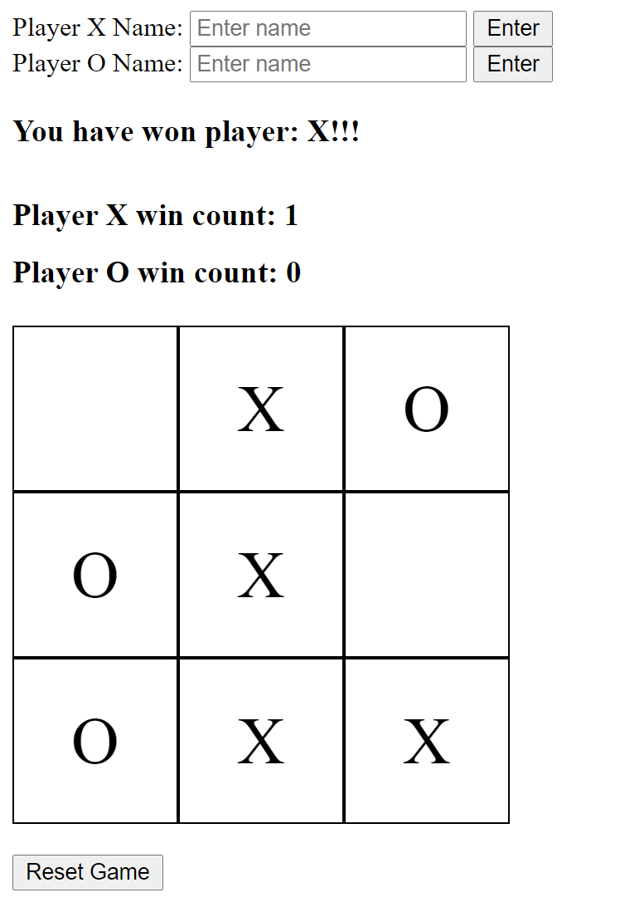

# Tic Tac Toe

#### Summary

A single-page app for a simple Tic Tac Toe game using native DOM methods, where:

- the first move always starts with player X
- the app detects a win or tie and displays an appropriate message
- a button resets the game for a new round of gameplay

